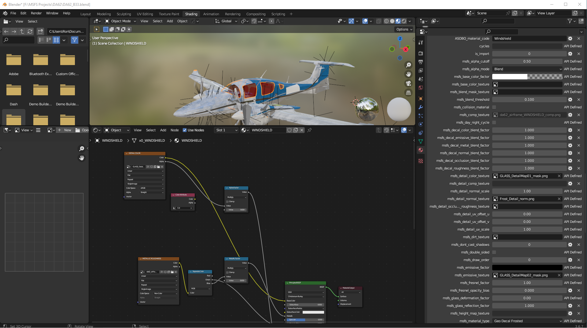

<!-- [](https://www.flightsimulator.com/)[](https://www.asobostudio.com/)  -->

# Documentation for Microsoft Flight Simulator glTF 2.0 Importer and Exporter for Blender

First of all, this addon adds some panels and options needed to have a correct model export ready to be used in the sim.

## Summary
1. [Materials Propreties](#Materials-Propreties)  
2. [Lights Propreties](#lights-propreties)
3. [Objects Propreties](#objects-propreties)
4. [Multi-Exporter glTF 2.0](#multi-exporter-gltf-20)
5. [Material Migration from Legacy and fbw (Fly-By-Wire importer)](#Migrate-Materials))


## Materials Propreties:
- When you select an object in Blender, you can access the material properties from the Object Ribbon on the right, under the Material Properties button. 


- When you want to export a model dedicated to Microsoft Flight Simulator, you need to set a Flight Simulator material to it:  


- When you set a Flight Simulator Material, you have to edit the material propreties from the MSFS Material Params only, if you edit the shader nodes it will break the export :


:warning: DO NOT EDIT THE SHADER PART

- If you want to learn more about the different materials listed and how to use them, you can refer to the SDK documentation on materials here: https://docs.flightsimulator.com/html/Asset_Creation/3DS_Max_Plugin/Materials.htm

## Lights Propreties

Once you have created your model in Blender and are ready to start adding lights you can add a spot light and see a list of new parameters to be setted:


If you want to lean more on what are these parameters, you can refer to the SDK Documentation on lights here: https://docs.flightsimulator.com/html/Asset_Creation/3DS_Max_Plugin/Lights.htm

## Objects Propreties
When you select an object, you can override its Unique ID that will be interprated by the sim using this checkbox here:


## Multi-Exporter glTF 2.0
- To export your model you need to use the multi-exporter view :


- There are two ways to export your model, you can use the Objects View or the Presets View :


### Objects View :

This view relies on the names of your root nodes in your scene. If your object's name starts with x0_ or ends with \_LOD0 it will be considered a LOD0 ( x1_ and _LOD1 will be LOD1, and so on). The rest of its name defines its category so that all the objects from the same family (ie: different LODs of the same asset) will be sorted together.

If you click on "Reload LODs" button, it will group your objects with LOD(s) as shown down bellow:


You need to set an export path that defines where you want to export your LOD(s):


If you tick "Generate XML" checkbox, it will create the XML file for the families of LOD selected. For example selecting Cube, Cube_LOD0 or all of Cube's LODs will produce the same result and generate one file "Cube.XML" for the Cube family. You can also work with multiple families at once.

#### Example:
```
    <?xml version="1.0" encoding="utf-8"?>
        <ModelInfo guid="{1b7127b5-7223-4980-8cc0-3b5417cb2412}" version="1.1">
            <LODS>
                <LOD minSize="0" ModelFile="Cube_LOD0.gltf"/>
                <LOD minSize="1" ModelFile="Cube_LOD1.gltf"/>
                <LOD minSize="2" ModelFile="Cube_LOD2.gltf"/>
            </LODS>
        </ModelInfo>
```

### Presets View :
The Presets View allows you to create Export Presets that will make it easier to export a large numbers of objects, animations and more. This exporter relies on Collections to be selected and added to a Preset, so you will need your scene to be split into relevant collections.

When you click on "Add Preset" Button, a new element will be added to the view (see figure down bellow). You can set it's name, export folder and enable it for export.


You will need to define which collections are applied to this Preset by clicking on "Edit Layers" Button:


When all your presets are set up you can click on "Export" Button:


### Settings View :
Here you can find the various export settings (geometry, animations, materials...etc) from the glTF export in Blender. You can disable the Microsoft Flight Simulator Extensions if you want to export your models as pure glTF(s) following the Khronos Schemas.


## Migrate Materials

If you have opened a legacy blend file or you have opened a file that you have imported with the fbw importer in an older version of Blender, you must migrate the MSFS materials to a new node structure compatable with this exporter.

### Migration of Legacy Blend File Material Types/Modes

This Blender addon is the non-official experimental addon for Microsoft Flight Simulator, and as such, blend files that were made using any other version/iteration of the addon are now considred *legacy* blend files. Basically, legacy blend files had the extensions that are used to create glTF 2.0 files for use in the Microsoft Flight Simulator hard-coded into them. However, the ASOBO version of the exporter uses the Khronos default code and adds hooks to this code for the ASOBO extensions used in the glTF files.

The ASOBO exporter also has a much more complex and versitile material node structure that can be seen in the Shader Tab/Window in Blender. Your legacy Flight Simulator Material mode/types should be migrated to the new ASOBO Microsoft Flight SImulator material mode/types with the click of the "**`Migrate Material Data`**" button
in the MSFS Material Parameters panel (under the Blender Material Properties). 

We have made every effort possible to ensure that legacy blend files can be easily and fully migrated to use this addon and exporter, and we recommend the migration to use this addon as soon as possible to ensure future compatibility as this addon evolves and is updated. 

Once you have performed a migration, you should look at the shader nodes in your *original* blend file and make sure the BSDF node paramerters are the same as the panel values.  This is an important check to make as these can get out of sync when you modify the parameters in the `Surface` section of the `Material Properties` panel instead of modifying them in the `MSFS Material Parameters` section. In particular, pay attention to the *Metallic* and *Roughness* Scale and Factor values.

<br>

## Steps For Migration

1. Open your blend file.
2. Select a node/mesh
3. Open the `MSFS Material Params` Panel in the Material Properties
    - You will see a `Migrate Material Data` button above the MSFS Material Params type drop down list.
    - **DO NOT Select a MSFS Material from the drop down**, this will erase the existing legacy data and you will lose all your material settings.
4. Click on the "Migrate Material Data" button
    - Your existing legacy material type/mode will be converted to the new ASOBO MSFS material type shader node structure.

Figure 1 Before migration


Figure 2 After Migration


All the settings from the legacy node structure are copied to the ASOBO exporter shader node structure. As you can see from the images above, the ASOBO node structure is more complex and there are a lot more nodes. Sometimes some model developers have made changes to the legacy BSDF node that are *not* reflected in the `MSFS Material Params` panel data - the variables that are migrated come instead from the *legacy* panel data, so there may be situations where your material will not look correct. This means that you will need to compare your legacy blend file materials to the new blend file Materials after migration to see if there are any issues like this one. You can do this by openeing another Blender instance and opening the legacy file in that, then comparing the MSFS Material Params panel values with the legacy parameter values and adjusting them accordingly.

Note that each Microsoft Flight Simulator material will need to be migrated, but any mesh/nodes associated to that material will also have it's MSFS Material Parameters migrated. 

Finally, you may also notice that some MSFS Material Parameters show data but *cannot* be adjusted. This is in keeping with the ASOBO 3DS Max exporter material parameters.  Please raise an issue if this is not to your requirements.

## WARNING
After migration SAVE YOUR FILE AS A NEW FILE and keep your legacy blend file for future reference.


### Migration of fbw (Fly-By-Wire) Blend File Material Types/Modes

Steps for migration of fbw imported objects is similar to the standard migration described above.  However the fbw importer creates materials that may not be one-to-one compatable with the ASOBO exporter. As an example the Glass material in the fbw node structure may translate to PortHole material.  In this case the material may have a "Pre-Migrate Legacy Data" button that will help with the translation of data.

1. Open your blend file.
2. Select a node/mesh
3. Open the `MSFS Material Params` Panel in the Material Properties
    - You may see a `Pre-Migrate Legacy Data` button above the MSFS Material Params type drop down list.
    - You will see a `Migrate Material Data` button above the MSFS Material Params type drop down list.
    - **DO NOT Select a MSFS Material from the drop down**, this will erase the existing legacy data and you will lose all your material settings.
4. In the Material panel section, there are a number of panels you can open.  One panel you have open is the "MSFS Material Params".  You should also open the Preview panel, usually at the top of the Material panel section.
5. View the material in the Preview panel of the object you have selected. Note how it looks. Note the MSFS Material Params - Type (drop down box)
6. Click on the "Pre-Migrate" button
    - Your existing legacy/fbw material type/mode data will replace default data so it will/can be converted to the new ASOBO MSFS material type shader node structure in a later step.

Figure 3 Before fbw Pre-Migrate


Figure 4 After fbw Pre-Migrate


7. Now note how the Preview looks.  If the preview has NOT changed significantly, it is safe to do the final Migration step.
    - If the preview has changed significantly, then further manual migration notations and adjustments will be require - see bolow
8. Click on the "Migrate Material Data" button
    - Your existing legacy material type/mode will be converted to the new ASOBO MSFS material type shader node structure.

### Pre-Migration Preview has changed the material significantly

1. Open the Custom Properties panel in the Material panel section.

2. You will see the behind the scenes data and variables that the exporter, both legacy, fbw and current ASOBO exporter use in exporting data to the gltf files for the material (BTW this is why modifying the surface panel or nodes directly is not recommended, these custom properties DO NOT get updated). Note in this case the fbw material is GeoDecalFrosted, but should be Windshield as seen in the Custom Properties

3. Note down any specific colors, textures that did not seem to get "migrated".  You may need to do a Pre-mirate and or Migrate and a CTRL+Z(Undo) back and forth to see what gets migrated and what does not.

4. Do a final Migrate and then change the MSFS Material Params panel manually to the values you noted down in the previous steps.

All the settings from the legacy node structure are copied to the ASOBO exporter shader node structure. As you can see from the images above, the ASOBO node structure is more complex and there are a lot more nodes. Sometimes some model developers have made changes to the legacy BSDF node that are *not* reflected in the `MSFS Material Params` panel data - the variables that are migrated come instead from the *legacy* panel data, so there may be situations where your material will not look correct. This means that you will need to compare your legacy blend file materials to the new blend file Materials after migration to see if there are any issues like this one. You can do this by openeing another Blender instance and opening the legacy file in that, then comparing the MSFS Material Params panel values with the legacy parameter values and adjusting them accordingly.

Note that each Microsoft Flight Simulator material will need to be migrated, but any mesh/nodes associated to that material will also have it's MSFS Material Parameters migrated. 

Finally, you may also notice that some MSFS Material Parameters show data but *cannot* be adjusted. This is in keeping with the ASOBO 3DS Max exporter material parameters.  Please raise an issue if this is not to your requirements.


Figure 5 Custom Properties fbw Pre-Migrate


Figure 6 Before fbw Pre-Migrate


Figure 7 After fbw Pre-Migrate


Figure 8 After Migrate Data


